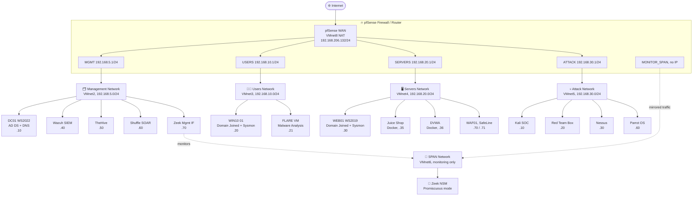
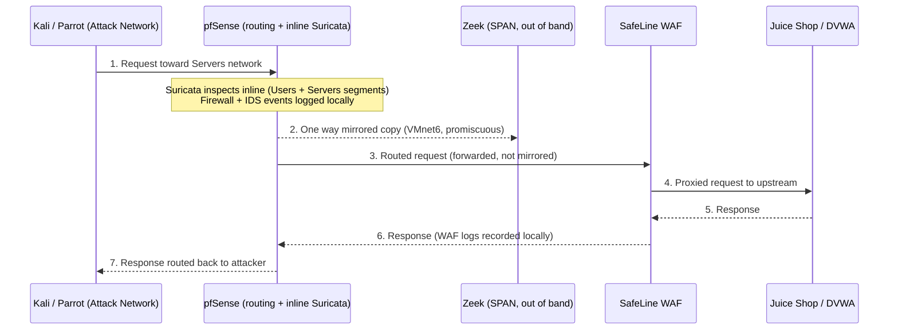
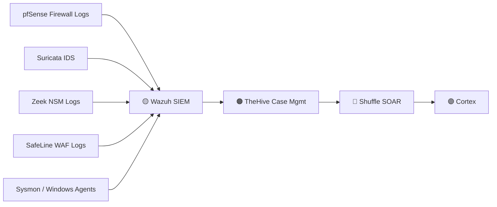

# Home SOC Lab: Small Enterprise Security Operations & Detection Engineering

<div align="center">


**A fully virtualized, segmented SOC lab modeled after a small enterprise network, built on VMware Workstation with pfSense, Suricata, Zeek, Wazuh, TheHive, Shuffle, and a vulnerable web application range behind a WAF.**

This repo is a complete guide to rebuild the entire lab from scratch, including the exact VMware network configuration used.

</div>

---

## 📖 Table of Contents

- [Overview](#-overview)
- [Architecture](#-architecture)
- [Network Segments](#-network-segments)
- [System Inventory](#-system-inventory)
- [Traffic & Detection Flow](#-traffic--detection-flow)
- [Detection & Response Stack](#-detection--response-stack)
- [Included Files](#-included-files)
- [Rebuild Guide](#-rebuild-guide)
- [Vulnerable Application Deployment](#-vulnerable-application-deployment)
- [WAF Configuration](#-waf-configuration)
- [Verifying the Detection Pipeline](#-verifying-the-detection-pipeline)
- [Security Notice](#-security-notice)
- [License](#-license)

---

## 🧭 Overview

This lab simulates a small enterprise network with segmented zones for management, users, servers, and offensive tooling, all routed through a central **pfSense** firewall and router. Traffic is inspected inline by **Suricata** and mirrored out of band to **Zeek** for network security monitoring. Vulnerable web applications sit behind a **SafeLine WAF** reverse proxy, and every detection source feeds into a **Wazuh, TheHive, and Shuffle** SIEM, case management, and SOAR pipeline, with **Sysmon** deployed on Windows endpoints for host level telemetry.

This build is used to practice:

- Network security monitoring and log analysis
- SIEM alerting and correlation (Wazuh)
- Case management and incident response (TheHive)
- Security automation and orchestration (Shuffle / SOAR)
- Web application attack and defense (DVWA, Juice Shop, WAF)
- Malware analysis (FLARE VM)
- Vulnerability scanning (Nessus)
- Host level telemetry (Sysmon and Windows Event Logs)

> ⚠️ This lab is designed to run fully isolated from production networks. See the [Security Notice](#-security-notice) before deploying.

---

## 🏗 Architecture

All virtual machines run on **VMware Workstation**, using host only networks for internal segments and NAT for internet egress. Every segment terminates on a **pfSense** virtual firewall, which routes and inspects traffic between zones.



---

## 🌐 Network Segments

| VMnet | Segment | Subnet | Gateway | Host Virtual Adapter | DHCP | Purpose |
|---|---|---|---|---|---|---|
| **VMnet2** | Management | `192.168.5.0/24` | `192.168.5.1` | ✅ Enabled | ❌ Disabled | Domain, SIEM, SOAR, case management |
| **VMnet3** | Users | `192.168.10.0/24` | `192.168.10.1` | ❌ Disabled | ❌ Disabled | Domain joined endpoints, malware analysis |
| **VMnet4** | Servers | `192.168.20.0/24` | `192.168.20.1` | ✅ Enabled | ❌ Disabled | Web servers, vulnerable apps, WAF |
| **VMnet5** | Attack | `192.168.30.0/24` | `192.168.30.1` | ✅ Enabled | ❌ Disabled | Red team and offensive tooling |
| **VMnet6** | SPAN (monitor) | dummy /24, unused | — | ❌ Disabled | ❌ Disabled | Mirrored traffic to Zeek only |
| **VMnet8** | NAT | `192.168.206.0/24` | — | — | — | Internet egress via pfSense WAN |

> 💡 **Note:** Disabling the VMware Host Virtual Adapter on VMnet3 resolved Kali and Linux internet connectivity issues observed during the build.
>
> 💡 **Note:** DHCP is disabled on every internal segment. All addressing is static, so every host's IP is predictable for detection and alerting rules.

### pfSense Interface Summary

| Interface | VMnet | IP Address | Role |
|---|---|---|---|
| WAN | VMnet8 | `192.168.206.132/24` | Internet facing (NAT) |
| MGMT | VMnet2 | `192.168.5.1/24` | Management gateway |
| USERS | VMnet3 | `192.168.10.1/24` | Users gateway |
| SERVERS | VMnet4 | `192.168.20.1/24` | Servers gateway |
| ATTACK | VMnet5 | `192.168.30.1/24` | Attack range gateway |
| MONITOR_SPAN | VMnet6 | (no IP) | Traffic mirror source for Zeek |

---

## 🖥 System Inventory

### 🗂 Management Network (`192.168.5.0/24`)

| Host | IP | Role |
|---|---|---|
| **DC01-WS2022** | `192.168.5.10` | Active Directory Domain Services, DNS |
| **Wazuh** | `192.168.5.40` | SIEM platform |
| **TheHive** | `192.168.5.50` | Case management platform |
| **Shuffle** | `192.168.5.60` | SOAR platform |
| **Zeek** | `192.168.5.70` | Network security monitoring (management interface) |
| Host PC | `192.168.5.254` | Physical host adapter (see [Rebuild Guide](#-rebuild-guide)) |

### 🧑‍💻 Users Network (`192.168.10.0/24`)

| Host | IP | Domain Joined | Notes |
|---|---|---|---|
| **WIN10-01** | `192.168.10.20` | ✅ Yes | Analyst and user workstation, Sysmon deployed |
| **FLARE-VM** | `192.168.10.21` | ❌ No | Malware analysis workstation, internet blocked |

**DNS for this segment:** `192.168.5.10` (DC01)

### 🖥 Servers Network (`192.168.20.0/24`)

| Host | IP | Notes |
|---|---|---|
| **WEB01-WS2019** | `192.168.20.30` | Domain joined, Sysmon deployed, DNS to `192.168.5.10` |
| **Juice Shop** | `192.168.20.35` | Dockerized vulnerable web app, DNS `8.8.8.8` |
| **DVWA** | `192.168.20.36` | Dockerized vulnerable web app, DNS `8.8.8.8` |
| **WAF01 (SafeLine)** | `192.168.20.70` / `192.168.20.71` | Reverse proxy and WAF for Juice Shop / DVWA |
| Host PC | `192.168.20.254` | Physical host adapter |

### 💀 Attack Network (`192.168.30.0/24`)

| Host | IP | Notes |
|---|---|---|
| **Kali SOC** | `192.168.30.10` | Primary attacker workstation |
| **Red Team** | `192.168.30.20` | Secondary offensive box |
| **Nessus** | `192.168.30.30` | Vulnerability scanner (`:8834`) |
| **Parrot OS** | `192.168.30.60` | Additional offensive tooling |
| Host PC | `192.168.30.254` | Physical host adapter |

All Attack network hosts use: Subnet `255.255.255.0`, Gateway `192.168.30.1`, DNS `8.8.8.8` / `8.8.4.4`

### 📡 SPAN / Monitoring Network (VMnet6)

| Endpoint | Interface | Notes |
|---|---|---|
| pfSense | `MONITOR_SPAN` | Mirrors production traffic out |
| Zeek | `ens37` (no IP, promiscuous) | Passive network monitor, never touches routed traffic |

---

## 🔀 Traffic & Detection Flow



Steps 1, 3, 4 carry the live request forward; steps 5 to 7 carry the response back along the same path. The mirror to Zeek in step 2 is a one way copy that never rejoins the traffic flow, Zeek only observes, it never forwards or blocks anything.

**Detection sources feeding the pipeline:**
- 🔥 pfSense firewall logs
- 🚨 Suricata IDS alerts
- 🦉 Zeek network logs
- 🛡️ SafeLine WAF logs
- 🖥️ Sysmon and Windows Event Logs (WIN10-01, WEB01-WS2019, DC01)

**End to end SIEM, IR, and SOAR pipeline:**



---

## 🧩 Detection & Response Stack

| Tool | Purpose |
|---|---|
| **pfSense** | Firewall, router, inline IDS (Suricata) |
| **Suricata** | Intrusion detection on Users and Servers segments |
| **Zeek** | Passive, out of band network security monitoring |
| **Wazuh** | SIEM, log aggregation, correlation, and alerting |
| **Sysmon** | Windows host telemetry (process, network, registry) |
| **TheHive** | Case management for incident response |
| **Shuffle** | SOAR, automated playbooks and workflows |
| **Cortex** | Automated observable and IOC analysis for TheHive |
| **SafeLine WAF** | Reverse proxy and web application firewall |
| **Nessus** | Vulnerability scanning across all segments |

---

## 📦 Included Files

| File | Description |
|---|---|
| `SOC LAB VMware Network Settings` | Exported **VMware Virtual Network Editor** configuration for all VMnets (VMnet2, 3, 4, 5, 6, 8) used in this lab, with subnets, DHCP state, and host adapter settings pre configured for a direct import instead of manual setup. |

### Method: Import from the Virtual Network Editor (Recommended)

1. Open **VMware Workstation** as **Administrator**.
2. Go to **Edit → Virtual Network Editor**.
3. Click **Change Settings** if prompted by UAC.
4. Click **Import**.
5. Browse to the **"SOC LAB VMware Network Settings"** network configuration file.
6. Click **Open**.
7. Click **Apply** or **OK**.
8. Restart VMware Workstation if necessary.

> This file saves you from manually recreating all six VMnets by hand. It's the fastest way to get your host ready for every step below.

---

## 🚀 Rebuild Guide

### Prerequisites

- VMware Workstation Pro (or compatible)
- ISOs and installers for: pfSense, Windows Server 2022, Windows Server 2019, Windows 10, Kali Linux, Parrot OS, FLARE VM base image, Wazuh, TheHive, Shuffle, Cortex, Zeek, Nessus, SafeLine WAF
- A host machine with enough RAM, CPU, and disk to run 12+ concurrent VMs (16+ vCPU / 32+ GB RAM recommended)

### Step 1: Import (or manually create) the virtual networks

Fastest path: import the **SOC LAB VMware Network Settings** file as described in [Included Files](#-included-files).

Manual path, in **VMware Workstation → Edit → Virtual Network Editor**, create the following host only networks:

| VMnet | Subnet | Host Virtual Adapter | DHCP |
|---|---|---|---|
| VMnet2 | `192.168.5.0/24` | Enabled | Disabled |
| VMnet3 | `192.168.10.0/24` | Disabled | Disabled |
| VMnet4 | `192.168.20.0/24` | Enabled | Disabled |
| VMnet5 | `192.168.30.0/24` | Enabled | Disabled |
| VMnet6 | (SPAN, no routed traffic) | Disabled | Disabled |
| VMnet8 | NAT (default) | — | — |

### Step 2: Configure your physical host adapters

> **Why this matters:** Checking "Connect a host virtual adapter to this network" in the Virtual Network Editor creates a virtual NIC directly on your physical machine. Left unconfigured, Windows will automatically assign the `.1` address on that adapter, which directly conflicts with the pfSense gateway IP. Setting the host adapters to the `.254` address keeps `.1` clear for pfSense. Pointing each host adapter's gateway at the matching pfSense interface lets your physical host route traffic to the other segments and out to the internet through pfSense, while your physical browser can still reach dashboards (Nessus, Wazuh, and so on) directly.

On the physical host: press **Win + R**, type **ncpa.cpl**, and hit Enter. Right click each VMware virtual adapter, select **Properties**, open **IPv4**, and set:

| Adapter | IP Address | Subnet Mask | Gateway | DNS |
|---|---|---|---|---|
| VMnet2 (Management) | `192.168.5.254` | `255.255.255.0` | `192.168.5.1` | (leave blank) |
| VMnet4 (Servers) | `192.168.20.254` | `255.255.255.0` | `192.168.20.1` | (leave blank) |
| VMnet5 (Attack) | `192.168.30.254` | `255.255.255.0` | `192.168.30.1` | (leave blank) |

### Step 3: Deploy pfSense

1. Attach pfSense's virtual NICs in this order: WAN to VMnet8, MGMT to VMnet2, USERS to VMnet3, SERVERS to VMnet4, ATTACK to VMnet5, MONITOR_SPAN to VMnet6.
2. Assign interface IPs per the [pfSense Interface Summary](#-network-segments) table above.
3. Create firewall rules per segment (deny by default between zones, allow only what your scenarios require).
4. Install and enable the **Suricata** package, bound to the Users and Servers interfaces.
5. Configure a port mirror or SPAN from your Servers and Users interfaces to the `MONITOR_SPAN` interface so Zeek can passively observe traffic.

### Step 4: Deploy the Management segment

1. **DC01-WS2022** (`192.168.5.10`): promote to a Domain Controller, configure DNS.
2. **Zeek** (`192.168.5.70` management IP): attach a second NIC to VMnet6 in promiscuous mode (no IP required on that interface), pointed at the mirrored SPAN traffic.
3. **Wazuh** (`192.168.5.40`): install per the official Wazuh documentation, joined to the Management network.
4. **TheHive** (`192.168.5.50`) and **Cortex**: install and connect Cortex to TheHive for automated observable analysis.
5. **Shuffle** (`192.168.5.60`): install and connect webhooks and apps for Wazuh and TheHive integration.

### Step 5: Deploy the Users segment

- **WIN10-01** (`192.168.10.20`): join to the domain, DNS pointed at DC01, install the Wazuh agent and Sysmon (a detection oriented config such as SwiftOnSecurity's is recommended).
- **FLARE-VM** (`192.168.10.21`): do not join to domain, keep internet access disabled or limited for malware safety.

### Step 6: Deploy the Servers segment

- **WEB01-WS2019** (`192.168.20.30`): join to domain, install the Wazuh agent and Sysmon.
- Deploy **Juice Shop** and **DVWA** containers (see [Vulnerable Application Deployment](#-vulnerable-application-deployment)).
- Deploy **WAF01** and configure SafeLine (see [WAF Configuration](#-waf-configuration)).

### Step 7: Deploy the Attack segment

- **Kali SOC** (`192.168.30.10`), **Red Team** (`192.168.30.20`), **Parrot** (`192.168.30.60`): standard offensive toolsets.
- **Nessus** (`192.168.30.30`): install per vendor docs, exposed on `:8834`, run authenticated and unauthenticated scans against the Users and Servers segments.

All Attack network hosts: Subnet `255.255.255.0`, Gateway `192.168.30.1`, DNS `8.8.8.8` (alt `8.8.4.4`).

### Step 8: Wire up log forwarding

- Forward pfSense firewall and Suricata logs to Wazuh (syslog or Filebeat).
- Forward Zeek logs to Wazuh (Filebeat module or syslog output).
- Forward SafeLine WAF logs to Wazuh.
- Confirm the Wazuh to TheHive alert to case automation and the Wazuh/TheHive to Shuffle playbook triggers are active.

---

## 🐳 Vulnerable Application Deployment

Both vulnerable web apps run as Docker containers on WEB01 in the Servers network.

**OWASP Juice Shop** (`192.168.20.35`):
```bash
sudo docker run -d --name juiceshop --restart unless-stopped -p 80:3000 bkimminich/juice-shop
```

**DVWA** (`192.168.20.36`):
```bash
sudo docker run -d --name dvwa -p 80:80 --restart unless-stopped vulnerables/web-dvwa
```

---

## 🔐 WAF Configuration

**WAF01** runs **SafeLine WAF** on Ubuntu Server as a reverse proxy in front of both vulnerable apps.

| Setting | Value |
|---|---|
| Primary IP (Juice Shop) | `192.168.20.70` |
| Secondary IP (DVWA) | `192.168.20.71` |
| Gateway | `192.168.20.1` |
| DNS | `8.8.8.8`, `8.8.4.4` |
| Management UI | `https://192.168.20.70:9443` |

### Reverse proxy applications

| App | Frontend IP | Ports | Certificate | Upstream |
|---|---|---|---|---|
| Juice Shop | `192.168.20.70` | 80, 443 | Lab wildcard cert | `http://192.168.20.35` |
| DVWA | `192.168.20.71` | 80, 443 | Lab wildcard cert | `http://192.168.20.36` |

> 🔑 **Credentials:** SafeLine admin, Nessus, and any other service logins are intentionally omitted from this repo. Set your own strong, unique credentials during deployment and store them in a local password manager. See [Security Notice](#-security-notice).

---

## ✅ Verifying the Detection Pipeline

Once every component above is deployed, confirm the full chain works end to end:

1. Generate traffic from Kali or Parrot toward a target on the Servers network (for example, an Nmap scan or a web attack against Juice Shop or DVWA).
2. Confirm the event is visible in this order: pfSense logs, then Suricata alerts, then Zeek logs, then SafeLine WAF logs.
3. Confirm the same event, or its Sysmon or agent equivalent on the target host, lands in Wazuh.
4. Confirm a case is created in TheHive from the Wazuh alert.
5. Confirm Shuffle picks up the case or alert and executes its configured playbook.
6. Confirm Cortex returns analyzer results on any observables attached to the case.

If all six checks pass, the detection to response pipeline is fully operational.

---

## 🔒 Security Notice

This repository documents a lab environment intended to run fully isolated from production networks, and ideally offline or NAT restricted from the internet. Before deploying or publishing your own version:

- Never reuse example or default credentials shown in any dashboard's out of the box installer. Set unique, strong passwords for every service (Wazuh, TheHive, Shuffle, SafeLine, Nessus, AD, and so on) and keep them out of version control.
- Do not expose lab management interfaces (SafeLine `:9443`, Nessus `:8834`, Wazuh dashboard, and so on) to the public internet.
- FLARE-VM and any malware samples should remain on an isolated segment with no internet connection at all times.
- The IP scheme in this document (`192.168.x.0/24`) is for a private, host only lab. Treat it as a template, not a production design.
- If you fork this repo, add a `.gitignore` for any exported VM configs, credentials, or `.ova`/`.vmx` files that may contain secrets.

---

## 📄 License

This project is licensed under the [MIT License](LICENSE). Feel free to fork, adapt, and build your own SOC lab from it.

---

<div align="center">

**⭐ If this helped you build your own SOC lab, consider starring the repo!**

</div>
